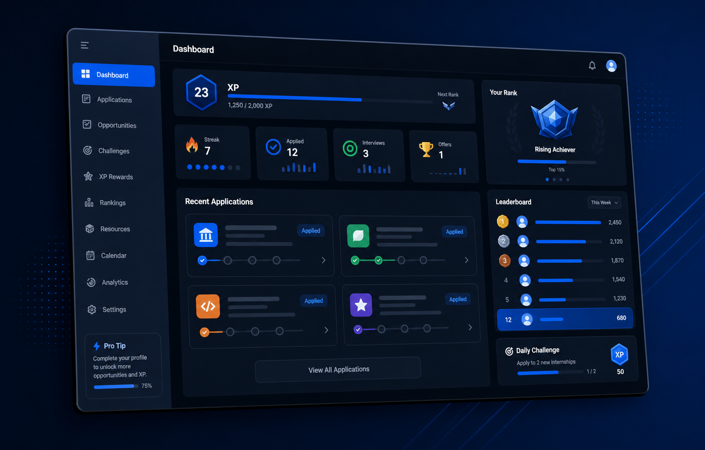

# CareerUp AI — DS 440 Capstone

CareerUp is an interactive job board and career-management platform for college students. It combines internship and new-graduate job discovery, resume-based fit scoring, application tracking, recruiting calendars, progress rewards, and peer accountability in one website.

CareerUp is **not a game**. It uses selected gamification ideas—XP, streaks, challenges, ranks, badges, rewards, and optional leaderboards—to make repetitive job-search tasks more engaging and encourage consistent action.

> **Current AI status:** the present matching system is a transparent, rule-based baseline. It extracts resume keywords and scores postings using role, location, work-mode, and skill overlap. A later capstone phase will add an AI model and evaluate it against this baseline.



## Current Features

- Email/password authentication and protected user accounts
- Student profiles with school, major, graduation year, target roles, and target locations
- PDF, DOCX, and text resume parsing
- Internship and new-graduate posting search
- Personalized, explainable baseline fit scores
- Application pipeline with saved, applied, interviewing, offer, and rejected stages
- Recruiting calendar for applications, deadlines, interviews, offers, and custom events
- XP, Reward Points, streaks, corporate ranks, badges, challenges, and unlockable resources
- Global, friends, and private-group leaderboards
- Friend requests, shareable profiles, optional application-board sharing, and mutual friends
- Role-level peer insights and direct messaging
- STAR behavioral-interview answer builder
- Supabase Row Level Security for private user data

## Technology

| Area | Technology |
| --- | --- |
| Web application | Next.js 14 and React 18 |
| Language | TypeScript |
| Styling | Tailwind CSS |
| Authentication/database | Supabase |
| Resume parsing | PDF Parse, PDF.js, and Mammoth |
| Icons | Lucide React |
| Deployment target | Vercel |

## Repository Layout

```text
DS440/
├── app/                 Next.js pages, layouts, and API routes
├── components/          Reusable interface components
├── lib/                 Business logic, data access, matching, and server actions
├── public/              Static images and public assets
├── scripts/             Maintenance and verification scripts
├── supabase/            Base schema and incremental database migrations
├── docs/                Project, architecture, data, workflow, and roadmap docs
├── .github/             Pull request and issue templates
├── middleware.ts        Login protection and Supabase session handling
└── package.json         Commands and dependencies
```

## Quick Start

### 1. Clone the repository

```bash
git clone https://github.com/Varun-gull/DS440.git
cd DS440
```

### 2. Install dependencies

```bash
npm ci
```

### 3. Configure environment variables

```bash
cp .env.local.example .env.local
```

Add the required Supabase values to `.env.local`. Never commit `.env.local` or service-role credentials.

### 4. Create the database

Create a Supabase project and run `supabase/schema.sql` in the Supabase SQL Editor. If an existing database was created from an earlier version, apply the additional SQL migrations in `supabase/` as needed and record which migrations were run.

### 5. Start the application

```bash
npm run dev
```

Open [http://localhost:3000](http://localhost:3000).

## Commands

| Command | Purpose |
| --- | --- |
| `npm run dev` | Start the local development server |
| `npm run build` | Create and validate a production build |
| `npm run start` | Run the production build locally |
| `npm run lint` | Check code quality |
| `npm run sync:postings` | Refresh the Supabase posting cache |
| `npm run verify:profile-messages` | Verify profile messaging with two test users |

Before submitting a pull request, run:

```bash
npm run lint
npm run build
```

## Job Posting Sources

CareerUp currently combines public, curated GitHub job lists from:

- Jobright AI
- SimplifyJobs
- SpeedyApply
- Zapply

Results may be cached in Supabase for faster searches. If live and cached sources are unavailable, the app uses clearly labeled sample postings. See [Data Sources](docs/DATA_SOURCES.md) for exact repositories and limitations.

## Documentation

- [Project Overview](docs/PROJECT_OVERVIEW.md)
- [Architecture](docs/ARCHITECTURE.md)
- [Data Sources](docs/DATA_SOURCES.md)
- [Development Workflow](docs/DEVELOPMENT_WORKFLOW.md)
- [Roadmap](docs/ROADMAP.md)

## Collaboration Rules

- Create a short branch for each task: `feature/...`, `fix/...`, or `docs/...`.
- Do not commit directly to `main` for normal development.
- Keep pull requests focused on one change.
- Describe how the change was tested.
- Never commit API keys, passwords, resumes, or private student data.
- Update documentation when behavior, data sources, database setup, or environment variables change.

## Course Objective

The capstone will compare the current keyword-based baseline with an AI-enhanced approach. The evaluation should measure recommendation accuracy, skill extraction, explanation quality, user usefulness, latency, cost, privacy, and failure cases.
